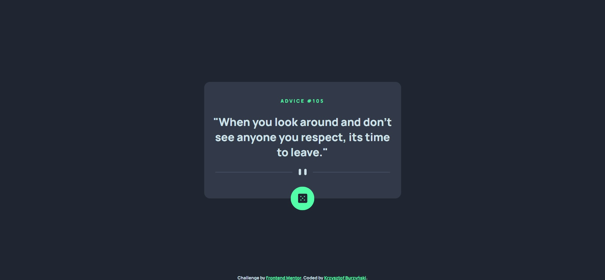

# Frontend Mentor - Advice Generator

## Table of contents
* [General info](#general-info)
* [Technologies](#technologies)
* [Screenshots](#screenshots)

## General info
This project was realized as a challenge of Frontend Mentor platform. [Click here](https://www.frontendmentor.io/challenges/advice-generator-app-QdUG-13db), to preview design of the vice GeneratorAd or check design files in this repository.

## Technologies
* HTML5
* CSS3
* Sass
* JavaScript
* API Fetch
* Webpack

## Screenshots

